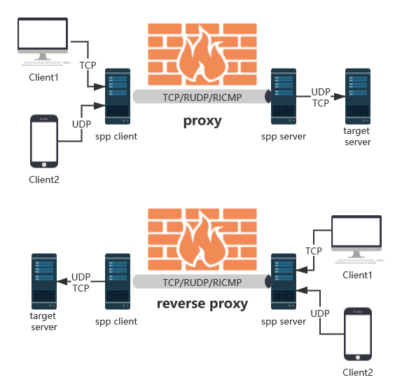

# SPP (Simple & Powerful Proxy)

[](https://github.com/esrrhs/spp)
[](https://github.com/esrrhs/spp)
[](https://github.com/esrrhs/spp/releases)
[](https://github.com/esrrhs/spp/releases)
[](https://hub.docker.com/repository/docker/esrrhs/spp)
[](https://github.com/esrrhs/spp/actions)

SPP is a versatile, high-performance network proxy and traffic-forwarding tool written in Go.

> **Disclaimer**: This tool is intended exclusively for academic, research, and authorized testing purposes. Do not use it for unauthorized or illegal activities.



---

## Key Features

* **Multi-Protocol Support**: TCP, UDP, RUDP (Reliable UDP), RICMP (Reliable ICMP), RHTTP (Reliable HTTP), KCP, and QUIC.
* **Flexible Proxy Modes**:
  * Forward Proxy
  * Reverse Proxy (NAT traversal / intranet penetration)
  * SOCKS5 Forward Proxy (with optional username/password auth)
  * SOCKS5 Reverse Proxy
  * Shadowsocks SIP003 Plugin support ([spp-shadowsocks-plugin](https://github.com/esrrhs/spp-shadowsocks-plugin))
* **Protocol Multiplexing & Conversion**: Proxy traffic from one protocol (e.g. TCP) over another internal transit protocol (e.g. QUIC, KCP, RUDP, or RICMP).
* **Security & Performance**: ChaCha20-Poly1305 / AES-GCM whole-frame AEAD (default), HMAC challenge-response login, zstd compression, and low CPU/memory overhead.
* **Ease of Operation**: Supports command-line flags or JSON configuration files, with graceful shutdown and health ping monitoring.

---

## Quick Start

### 1. Installation

Download precompiled binaries from the **[Releases Page](https://github.com/esrrhs/spp/releases)**, or build from source:

```bash
git clone https://github.com/esrrhs/spp.git
cd spp
go build -o spp .
```

### 2. Basic Example

* **Start Server** (listening on TCP port 8888):
  ```bash
  ./spp -type server -proto tcp -listen :8888
  ```

* **Start Client** (forward local port 8080 to target port 8080 via the server):
  ```bash
  ./spp -name "client1" -type proxy_client -server www.server.com:8888 -fromaddr :8080 -toaddr :8080 -proxyproto tcp
  ```

* **Start SOCKS5 Proxy** (open SOCKS5 proxy on local port 8080):
  ```bash
  ./spp -name "socks5" -type socks5_client -server www.server.com:8888 -fromaddr :8080 -proxyproto tcp
  ```

### 3. Using Configuration Files

```bash
# Start server with config
./spp -config config_server.json

# Start client with config
./spp -config config_client.json
```

---

## Documentation

👉 **For the complete guide, detailed examples, protocol conversion matrix, and configuration options, please see the [Usage Guide (USAGE.md)](USAGE.md).**

---

## Performance Benchmark

Maximum single-machine bandwidth testing with TCP proxy over various internal transit protocols (tested via `iperf`):

| Protocol Combination | Speed (Direct) | Speed (Encrypted) | Speed (Encrypted + Compressed) |
| :--- | :--- | :--- | :--- |
| Direct Connection | 3535 MB/s | - | - |
| TCP Forwarding | 663 MB/s | 225 MB/s | 23.4 MB/s |
| QUIC Forwarding | 35.5 MB/s | 32.8 MB/s | 15.1 MB/s |
| KCP Forwarding | 18.2 MB/s | 18.6 MB/s | 14.7 MB/s |
| RHTTP Forwarding | 10.7 MB/s | 10.8 MB/s | 8.73 MB/s |
| RUDP Forwarding | 5.15 MB/s | 5.81 MB/s | 5.05 MB/s |
| RICMP Forwarding | 3.34 MB/s | 3.25 MB/s | 3.46 MB/s |

---
